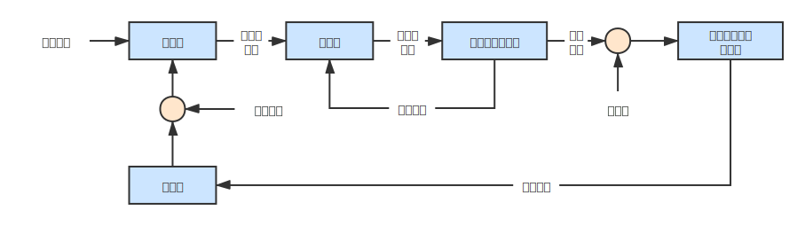
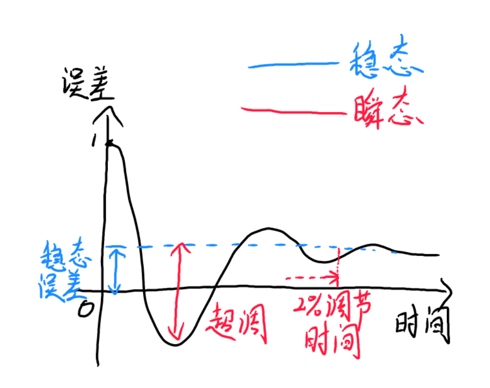

# 控制技术

## 控制对象的分类

- 运动控制
- 力控制
- 混合力位控制（例如：在黑板上写字）
- 阻抗控制（例如：使用机器人模拟虚拟环境）

## 典型机器人控制系统

## 误差相应的描述方法

- 瞬态响应：超调、调节时间

- 稳态响应：稳态误差

## 线性误差动力学

线性系统的误差动力学可以通过线性常微分方程描述：
$$
a_{p}\theta^{(p)}_{e}+a_{p-1}\theta^{(p-1)}_{e}+...+a_{1}\theta^{(1)}_{e}+a_{0}\theta_{e}=c
$$
例如，如图所示的质量-阻尼-弹簧系统可以描述为：
$$
m\theta^{(2)}_e + b\theta^{(1)}_{e} + k\theta^{(0)}_{e}=0
$$

