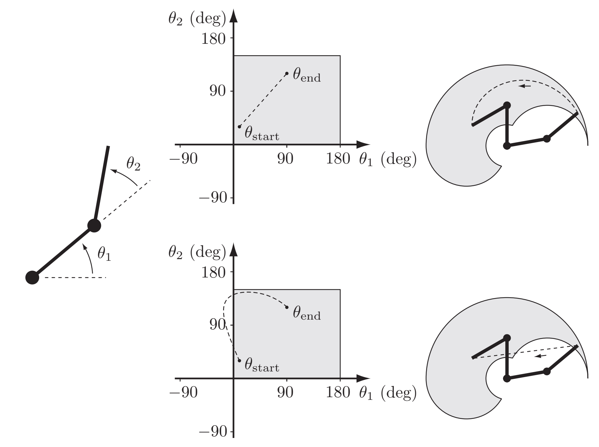
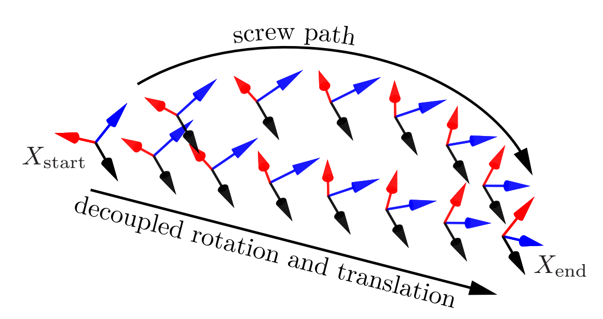
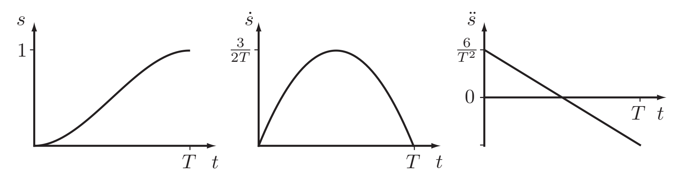
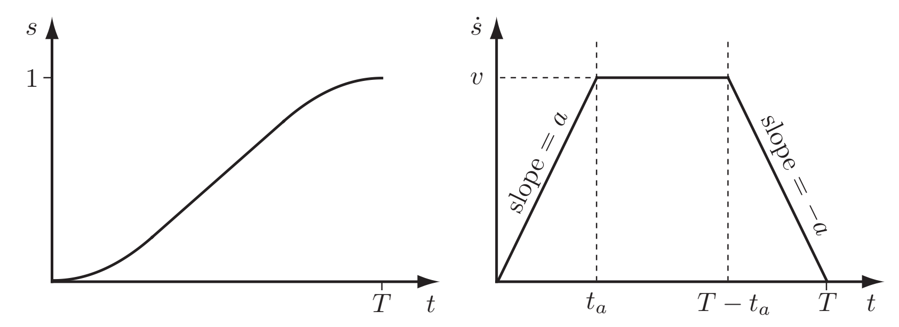
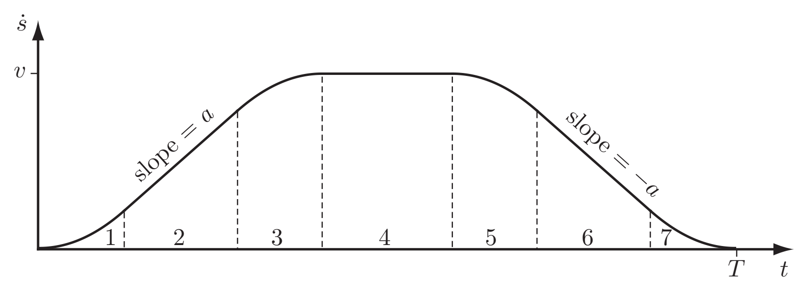

# 轨迹规划

## 1 概念：轨迹与路径

- 轨迹（Trajectory）：$\theta(t),t\in[0,T]$

  轨迹是位形 $\theta$ 与时间 $t$ 的关系，并可以推导出沿时间的**速度**、**加速度**

- 路径（Path）：$\theta(s),s\in[0,1]$

  路径指定了位形 $\theta$ 和路径完成量 $s$ 的关系，与时间 $t$ 无关

- 时间标度（Time Scalint）：$s(t),t\in[0,T]$

  时间标度指定了路径完成量 $s$ 与时间 $t$ 的关系，与位形无关

**轨迹 = 路径 + 时间标度**，下面对每一类轨迹的讨论，也将分为路径和时间标度两部分。

## 2 点对点的直线轨迹

### 2.1 路径

**1.关节空间的直线路径**
$$
\theta(s)=\theta_{start}+s(\theta_{end}-\theta_{start}),s\in[0,1]
$$
解析：关节空间中的直线路径在工作空间中往往不是直线。图中的上方是关节空间直线路径，下方是工作空间直线路径

**2.工作空间的直线路径（运动旋量）**
$$
X(s)=X_{start}\exp(\log(X^{-1}_{start}X_{end})s),s\in[0,1]
$$

**3.工作空间的直线路径（位置向量和姿态矩阵分离）**
$$
\begin{align}
p(s)&=p_{start}+s(p_{end}-p_{start})\\
X(s)&=X_{start}\exp(\log(X^{-1}_{start}X_{end})s),s\in[0,1]
\end{align}
$$
辨析：2.运动旋量直线路径 和 3.位置-姿态分离直线路径

### 2.2 时间标度

**1.多项式时间标度**

**（1）三次多项式**
$$
\begin{align}
s(t) &= a_{0}+a_{1}t+a_{2}t^{2}+a_{3}t^{3}\\
\dot{s}(t) &= a_{1}+2a_{2}t+3a_{3}t^{2}
\end{align}

$$
约束条件：$s(0)=0, s(T)=1, \dot{s}(0)=\dot{s}(T)=0$

**（2）五次多项式**
$$
\begin{align}
s(t) &= a_{0}+a_{1}t+a_{2}t^{2}+a_{3}t^{3}+a_{4}t^{4}+a_{5}t^{5}\\
\dot{s}(t) &= a_{1}+2a_{2}t+3a_{3}t^{2}+4a_{4}^{3}+5a_{5}t^{4}\\
\ddot{s}(t) &= 2a_{2}+6a_{3}t+12a_{4}^{2}+20a_{5}t^{3}
\end{align}
$$
约束条件：$s(0)=0, s(T)=1, \dot{s}(0)=\dot{s}(T)=0, \ddot{s}(0)=\ddot{s}(T)=0$

**2.梯形时间标度**

**3.S曲线时间标度**

## 3 有中间点的多项式轨迹

