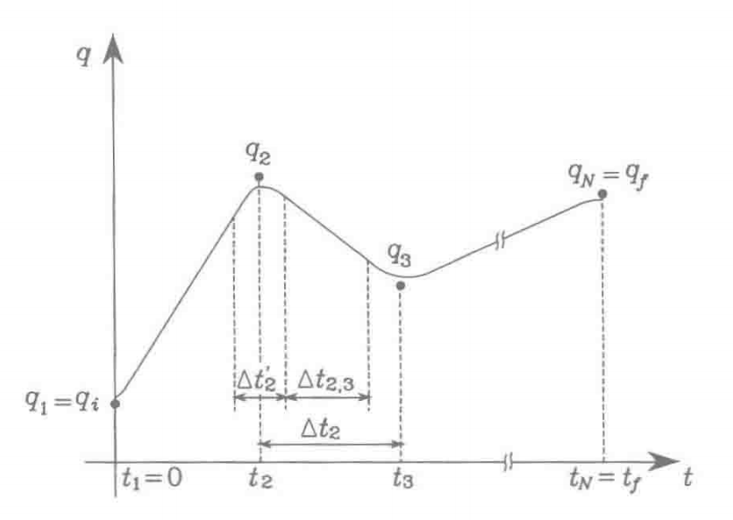

# 1 基本功能函数

## 零值判断 I near_zero

### 函数声明

`if_ture = near_zero(x)`

### 使用说明

判断所输入的标量是否足够小以至于可以视作0。

### 理论解析


## 向量单位化 I normalize

`norm_vec = normalize(vec)`

将所输入的向量单位化。

## 旋转矩阵求逆

`R_inv = rot_inv(R)`

计算旋转矩阵的逆矩阵

## 齐次变换矩阵求逆

`T_inv = rot_inv(T)`

计算齐次变换矩阵的逆矩阵

## 旋转矩阵规范化

`R = project_to_SO3(mat)`

将一个矩阵投射成为旋转矩阵。注：原矩阵必须接近于旋转矩阵。

### 理论解析

## 齐次变换矩阵规范化

`R = project_to_SE3(mat)`

将一个矩阵投射成为齐次变换矩阵。注：原矩阵必须接近于齐次变换矩阵。

**理论解析：**

## 旋转矩阵范数

`norm_mat = distance_to_SO3(mat)`

计算矩阵范数，该范数可衡量该矩阵与SO(3)矩阵的接近程度。

## 齐次变换矩阵范数

`norm_mat = distance_to_SE3(mat)`

计算矩阵范数，该范数可衡量该矩阵与SE(3)矩阵的接近程度。

## 旋转矩阵判断

`if_ture = test_if_SO3(x)`

判断一个矩阵是否是SO(3)矩阵。

## 齐次变换矩阵判断

`if_ture = test_if_SE3(x)`

判断一个矩阵是否是SE(3)矩阵。

# 2 机器人的基本数学方法

## ZYX欧拉角->旋转矩阵

`R = euler_to_matrix(euler)`

将 $zyx$ 欧拉角转换为旋转矩阵。

**输入：**

`euler`： $zyx$ 欧拉角

**输出：**

`SO3mat`： $SO(3)$ 旋转矩阵

**理论解析：**

刚体最初与参考坐标系重合，令其先绕物体坐标系的 $z$ 轴旋转角度 $\alpha$ ，再绕新的 $y$ 轴旋转角度 $\beta$ ，再绕新的 $x$ 轴旋转角度 $\gamma$ ，所得到的新姿态矩阵 $R$ 可计算为：
$$
\begin{align}
	R(\alpha,\beta,\gamma) &= \mathrm{Rot}(z,\alpha)\mathrm{Rot}(y,\beta)\mathrm{Rot}(x,\gamma)\\
	&=\begin{bmatrix}
		\cos\alpha&-\sin\alpha&0 \\ 
		\sin\alpha& \cos\alpha &0 \\ 
		0 & 0 & 1
	   \end{bmatrix}
		\begin{bmatrix}
		\cos\beta& 0 & \sin\beta\\ 
		0& 1 &0 \\ 
		-\sin\beta& 0 &\cos\beta 
		\end{bmatrix}
		\begin{bmatrix}
		1& 0 &0 \\ 
		0& \cos\gamma &-\sin\gamma \\ 
		0& \sin\gamma &\cos\gamma 
		\end{bmatrix}\\
\end{align}
$$

## 旋转矩阵 -> ZYX欧拉角

`euler = matrix_to_euler(R)`

将旋转矩阵转换为**$zyx$欧拉角**。

## 角速度向量 -> so(3)

`so3mat = vec_to_so3(vec)`

将 $\mathbb{R}^3$ 角速度向量转换为对应的 $so(3)$ **斜对称矩阵**。

## so(3) -> 角速度向量

`vec = so3_to_vec(so3mat)`

将 $so(3)$ 斜对称矩阵转换为对应的 $\mathbb{R}^3$ **角速度向量**。

## 空间速度向量 -> se(3)

`se3mat = vec_to_se3(vec)`

将 $\mathbb{R}^6$ 空间速度向量转换为对应的 **$se(3)$ 矩阵。**

## se(3) -> 空间速度向量

`vec = se3_to_vec(se3mat)`

将 $se(3)$ 矩阵转换为对应的 $\mathbb{R}^6$ **空间速度向量**。

## 旋转指数坐标 -> 轴角

`omghat, theta = axis_ang_3(expc3)`

将代表旋转的3维指数坐标转换为对应的**旋转轴和旋转角**。

## 刚体运动指数坐标 -> 轴角

`omghat, theta = axis_ang_6(expc6)`

将代表刚体运动的6维指数坐标转换为对应的**旋转轴和旋转角**。

## so(3)矩阵指数

`R = matrix_exp_3(so3mat)`

矩阵指数函数，计算 $so(3)$ 斜对称矩阵所对应的**旋转矩阵**。

## so(3)矩阵对数

`so3mat = matrix_log_3(R)`

矩阵对数函数，计算旋转矩阵所对应的 $so(3)$ **斜对称矩阵**。

## se(3)矩阵指数

`T = matrix_exp_6(se3mat)`

矩阵指数函数，计算 $se(3)$ 矩阵所对应的**齐次变换矩阵**。

## se(3)矩阵对数

`se3mat = matrix_log_6(T)`

矩阵对数函数，计算齐次变换矩阵所对应的 $se(3)$ **矩阵**。

## 合成齐次变换矩阵

`T = Rp_to_trans(R, p)`

将姿态矩阵和位置向量转换为对应的**齐次变换矩阵**。

## 分解齐次变换矩阵

`R, p = trans_to_Rp(T)`

将**齐次变换矩阵**转换为对应的姿态矩阵和位置向量。

## 齐次变换矩阵的伴随矩阵

`ad_T = adjoint(T)`

计算齐次变换矩阵的伴随矩阵。

**理论解析：**

对于给定 $T=(R,p)\in SE(3)$，其伴随矩阵为：
$$
[Ad_{T}] = \begin{bmatrix}
R & 0 \\ 
[p]R & R
\end{bmatrix}
\in \mathbb{R}^{6 \times 6}
$$
伴随矩阵的作用类似于旋转矩阵，可以用于运动旋量的参考系变换。

## 运动旋量的李括号

`ad_V = ad(V)`

对于一个运动旋量 $\mathcal{V}$，计算对应的矩阵 $\mathrm{ad}_{\mathcal{V}}$ 。本函数用于计算两个运动旋量 $\mathcal{V}_{1},\mathcal{V}_{2}$ 的李括号 $\mathrm{ad}_{\mathcal{V}_{1}}(\mathcal{V}_{2})$ ，李括号用于书写刚体动力学的牛顿-欧拉方程。

**理论解析：**

李括号可以看成是三维向量叉乘运算在六维旋量中的推广。对于给定的两个运动旋量 $\mathcal{V}_{1}=(\omega_{1},v_1),\mathcal{V}_{2}(\omega_{2},v_2)$，其李括号为：
$$
\begin{align}
\mathrm{ad}_{\mathcal{V}_{1}}(\mathcal{V}_{2})&=[\mathcal{V}_{1}][\mathcal{V}_{2}]-[\mathcal{V}_{2}][\mathcal{V}_{1}]\\
&=\begin{bmatrix}
[\omega_{1}] &0 \\ 
[v_{1}]] &[\omega_{2}]
\end{bmatrix}
\begin{bmatrix}
\omega_{2}\\ 
v_{2}
\end{bmatrix}
\end{align}
$$

# 3 机器人运动学

## 正向运动学 I 物体坐标系

`T = fkin_body(M, Slist, thetalist)`

正向运动学函数，利用指数积公式（PoE）计算开链机器人的正向运动学，参考系为末端坐标系。

**输入：**

`M`：初始齐次变换矩阵

`Slist`：各关节的螺旋轴

`thetalist`：各关节的值

**输出：**

`T`：末端的齐次变换矩阵

**理论解析：**

使用指数积公式计算开链机器人的正向运动学，需要如下步骤：

（1）分析机器人各关节处于零位时的末端位形，用齐次变换矩阵 $M$ 表示；

（2）分析机器人处于零位时的各关节螺旋轴，用向量 $B_{1},...,B_{n}$ 表示，参考系为末端坐标系 $\{b\}$；

（3）输入各关节变量 $\theta_{1},...,\theta_{n}$ ，代入如下公式，计算对应的末端齐次变换矩阵 $T$ 
$$
T=Me^{[B_{1}]\theta_{1}}...e^{[B_{n}]\theta_{n}}
$$

## 正向运动学 I 空间坐标系

`T = fkin_space(M, Slist, thetalist)`

正向运动学函数，利用指数积公式（PoE）计算开链机器人的正向运动学，参考系为空间坐标系。

**输入：**

`M`：初始齐次变换矩阵

`Slist`：各关节的螺旋轴

`thetalist`：各关节的值

**输出：**

`T`：末端的齐次变换矩阵

**理论解析：**

使用指数积公式计算开链机器人的正向运动学，需要如下步骤：

（1）分析机器人各关节处于零位时的末端位形，用齐次变换矩阵 $M$ 表示；

（2）分析机器人处于零位时的各关节螺旋轴，用向量 $S_{1},...,S_{n}$ 表示，参考系为空间坐标系 $\{s\}$；

（3）输入各关节变量 $\theta_{1},...,\theta_{n}$ ，代入如下公式，计算对应的末端齐次变换矩阵 $T$ 
$$
T=e^{[S_{1}]\theta_{1}}...e^{[S_{n}]\theta_{n}}M
$$

## 雅可比矩阵 I 物体坐标系

`jacob_b = jacobian_body(Blist, thetalist)`

计算开链机器人的**物体雅可比矩阵**（Body Jacobian）

## 雅可比矩阵 I 空间坐标系

`jacob_s = jacobian_space(Slist, thetalist)`

计算开链机器人的**空间雅可比矩阵**（Space Jacobian）

**理论解析：**

空间雅可比矩阵 $J_{s}(\theta)$ ，可以将关节速度向量 $\dot{\theta}$ 转化为末端运动旋量 $\mathcal{V}_{s}$ ：
$$
\mathcal{V}_{s} =J_{s}(\theta)\dot{\theta}
$$
其第 $i$ 列为：
$$
J_{si}(\theta)=\mathrm{Ad}_{e^{[S_{1}]\theta}...e^{[S_{i-1}]\theta_{i-1}}}(\mathcal{S}_{i})
$$
$J_{si}(\theta)$ 的物理意义为：当机器人各关节位形为  $\theta$ 时，关节 $i$ 以单位速度运动，其余关节不运动，所形成的**末端运动旋量**。当机器人处于零位时，该末端运动旋量就等于关节螺旋轴 $\mathcal{S}_{i}$ 。上述运动旋量的参考系均为空间坐标系 $\{s\}$ 

## 逆运动学 I 数值法

`thetalist, success = ikin_body(Blist, M, T, thetalist0, eomg, ev)`

采用**牛顿-拉夫森方法**计算**逆运动学**，基于物体坐标系。

**理论解析：**

（1）初始化：已知目标位形矩阵 $T_{sd}$ ，关节向量初始估计值 $\theta^{0} \in \mathbb{R}^{n}$，计数 $i=0$ 

（2）计算末端位形的误差，用运动旋量来表示：
$$
[\mathcal{V}_{b}]=\log(T^{-1}_{sb}T_{sd})
$$
（3）如果姿态误差或位置误差不满足要求，则更新初值，并将计数增1：
$$
\theta^{i+1}=\theta^{i}+J^{十}(\theta^{i})\mathcal{V}_{b}\\
i = i+1
$$

# 4 机器人动力学

## 逆动力学 I 牛顿 - 欧拉法

`taulist = inverse_dynamics(thetalist, dthetalist, ddthetalist, g, Ftip, Mlist, Glist, Slist)`

逆动力学计算函数，根据给定的关节位置、速度、加速度，计算所需的关节力矩

**理论解析：**

在机器人的每个连杆质心处设定一个参考系 {i} ，基座为 {0} ，末端执行器为 {i+1} 。

如果关节 i 的螺旋轴在基坐标系下表示为 $\mathcal{S}_{i}$ ，坐标系 {i} 相对于基坐标系的变换矩阵为 $M_{i}$ ，则关节 i 的螺旋轴在坐标系 {i} 下可表示为：
$$
\mathcal{A}_{i}=\mathrm{Ad}_{M_{i}^{-1}}(\mathcal{S}_{i})
$$
（1）给定各关节 $\theta,\dot{\theta},\ddot{\theta}$，从 $i=1$ 开始执行逆动力学的正向迭代：
$$
\begin{align}
T_{i,i-1} &= e^{-[\mathcal{A}_{i}]\theta_{i}}M_{i,i-1}\\
\mathcal{V}_{i} &= \mathrm{Ad}_{T_{i, i-1}}(\mathcal{V}_{i-1})+\mathcal{A}_{i}\dot{\theta}_{i}\\
\dot{\mathcal{V}}_{i} &= \mathrm{Ad}_{T_{i, i-1}}(\dot{\mathcal{V}}_{i-1})+\mathrm{ad}_{\mathcal{V}_{i}}(\mathcal{A}_{i})+\mathcal{A}_{i}\ddot{\theta}_{i}
\end{align}
$$
其中，$\mathcal{V}_{0}$ 一般为零向量，$\dot{\mathcal{V}}_{0}=(\dot{\omega}_{0},\dot{v}_{0})=(0,-\mathbb{g})$，即初始的基座加速度应当包含重力加速度 $\mathbb{g}$

（2）从 $i=n$ 开始执行逆动力学的逆向迭代：
$$
\begin{align}
\mathcal{F}_{i} &= \mathrm{Ad}_{T_{i+1,i}}^{\mathrm{T}}(\mathcal{F}_{i+1})+\mathcal{G}\dot{\mathcal{V}_{i}}-\mathrm{ad}_{\mathcal{V}_{i}}^{\mathrm{T}}(\mathcal{G}_{i}\mathcal{V}_{i})\\
\tau_{i} &= \mathcal{F}_{i}^{\mathrm{T}}\mathcal{A}_{i}
\end{align}
$$

## 惯量矩阵

`M = mass_matrix(thetalist, Mlist, Glist, Slist)`

计算惯量矩阵（多次调用逆动力学算法）

**理论解析：**

由于机器人的动力学方程可写为：
$$
\tau = M(\theta)\ddot{\theta}+c(\theta,\dot{\theta})+g(\theta)+J^{\mathrm{T}}(\theta)\mathcal{F}_{\mathrm{tip}}
$$
对于给定关节位置向量 $\theta$，只要令 $\mathbb{g}=0,\dot{\theta}=0,\mathcal{F}_{\mathrm{tip}}=0$ ，且 $\ddot{\theta}$ 的第 i 行为1，则上式得到的 $\tau$ 就等于惯量矩阵 $M(\theta)$ 的第 i 列。以此类推，将该式调用 n 次，就可以构建完整的惯量矩阵了。

## 科氏力和向心力

`c = vel_quadratic_forces(thetalist, dthetalist, Mlist, Glist, Slist)`

计算科氏力项和向心项（调用逆动力学算法）

**理论解析：**

由于机器人的动力学方程可写为：
$$
\tau = M(\theta)\ddot{\theta}+c(\theta,\dot{\theta})+g(\theta)+J^{\mathrm{T}}(\theta)\mathcal{F}_{\mathrm{tip}}
$$
对于给定关节位置向量 $\theta$，只要令 $\mathbb{g}=0,\ddot{\theta}=0,\mathcal{F}_{\mathrm{tip}}=0$ ，计算逆动力学，得到的就是科氏力项和向心项 $c(\theta,\dot{\theta})$。

## 末端力旋量所对应的关节力

`taulist = end_effector_forces(thetalist, Ftip, Mlist, Glist, Slist)`

计算关节力矩，以对抗末端执行器的力旋量（调用逆动力学算法）

由于机器人的动力学方程可写为：
$$
\tau = M(\theta)\ddot{\theta}+c(\theta,\dot{\theta})+g(\theta)+J^{\mathrm{T}}(\theta)\mathcal{F}_{\mathrm{tip}}
$$
对于给定关节位置向量 $\theta$，只要令 $\mathbb{g}=0,\dot{\theta}=0,\ddot{\theta}=0$ ，计算逆动力学，得到的就是末端力旋量 $F_{\mathrm{tip}}$ 对应的关节力矩  $J^{\mathrm{T}}(\theta)\mathcal{F}_{\mathrm{tip}}$。

## 正向动力学

`ddthetalist = forward_dynamics(thetalist, dthetalist, taulist, g, Ftip, Mlist, Glist, Slist)`

正向动力学计算函数，根据给定的关节位置、速度、力/力矩，计算得到的关节加速度

**理论解析：**

由于机器人的动力学方程可写为：
$$
\tau = M(\theta)\ddot{\theta}+c(\theta,\dot{\theta})+g(\theta)+J^{\mathrm{T}}(\theta)\mathcal{F}_{\mathrm{tip}}
$$
将上式改写如下，即可计算正向动力学：
$$
\ddot{\theta}=M(\theta)^{-1}(\tau(t) - c(\theta,\dot{\theta}) - g(\theta) - J^{\mathrm{T}}(\theta)\mathcal{F}_{\mathrm{tip}})
$$
其中各项分别可以通过惯量矩阵函数、科氏力向心力函数、末端力对应关节力函数来计算。

# 5 轨迹规划

## 三次多项式标度

### 理论解析

三次多项式是一种形式简单的时间标度
$$
\begin{align}
s(t) &= a_{0} + a_{1}t + a_{2}t^{2} + a_{3}t^{3} \\
\dot{s}(t) &= a_{1} +2a_{2}t +3a_{3}t^{2}
\end{align}
$$
假设我们有如下约束条件：
$$
\begin{align}
s(0) &= s_0 \\
s(T) &= s_{1} \\
\dot{s}(0) &= v_{0}\\
\dot{s}(T) &= v_{1}
\end{align}
$$
解得：
$$
\begin{align}
a_{0} &= s_{0} \\
a_{1} &= v_{0} \\
a_{2} &= \frac{-3s_{0}+3s_{1}-2v_{0}T-v_{1}T}{T^{2}} \\
a_{3} &= \frac{2s_{0}-2s_{1}+v_{0}T+v_{1}T}{T^{3}}
\end{align}
$$


## 多段抛物线混合轨迹

`ms_trajectory`

生成多段、多轴轨迹

输入：

- viapoint：路径点集合，每行一个点
- dt：单步时间
- tacc：加速时间（秒）
- qdmax：最大关节速度，默认为 None
- tsegment：每段运动的最大时间（秒），默认为 None
- q0：初始关节位置，默认为 viapoint 的第一行
- qd0：初始关节速度，默认为0
- qdf：终止关节速度，默认为0
- verbose：输出的 debug 信息，默认为 False

输出：

- 轨迹

注意事项：

- qdmax 和 tsegment 中只能指定一个，另一个必须为空列表 []
- 如果没有输出参数，则绘制轨迹图
- 路径长度 K 是关于路径点数量、q0、dt 和 tacc 的函数

**理论解析：**

考虑在 $t_1, ..., t_N$ 时刻用线性分段插入 $N$ 个路径点 $q_1,...,q_N$ ，形成轨迹函数 $q(t)$ 。为了避免 $q(t)$ 的一阶导数在 $t_k$ 附近不连续，我们在两段线性轨迹之间使用抛物线来进行混合。

令 $\Delta t_{k}=t_{k+1} - t_{k}$，为轨迹在路径点 $q_{k}$ 到路径点 $q_{k+1}$ 之间的时间长度。该段时长可分为三部分：

- 第1个匀加速度段。加速度为 $\ddot{q}_{k}$，持续时间为 $0.5 \Delta t^{'}_{k}$
- 匀速段。速度为 $\dot{q}_{k, k+1}$，持续时间为 $\Delta t_{k, k+1}$
- 第2个匀加速度段。加速度为 $\ddot{q}_{k+1}$，持续时间为 $0.5\Delta t^{'}_{k+1}$

其中：
$$
\dot{q}_{k, k+1} = \frac{q_{k+1} - q_{k}}{\Delta t_{k}}\\
\ddot{q}_{k}=\frac{\dot{q}_{k, k+1} - \dot{q}_{k-1, k}}{\Delta{t}_{k}^{'}}
$$


如图所示，以 $\Delta t_{2}$ 为例，



# 6 机器人控制

## 计算力矩

`taulist = computed_torque(thetalist, dthetalist, eint, g, Mlist, Glist, Slist, thetalistd, dthetalistd, ddthetalistd, Kp, Ki, Kd)`

计算力矩函数，计算对应的PID参数、运动学和动力学参数所需要的关节力矩。

**理论解析：**

## 控制策略仿真

`[taumat,thetamat] = simulate_control(thetalist, dthetalist, g, Ftipmat, Mlist, Glist, Slist, thetamatd, dthetamatd, ddthetamatd, gtilde, Mtildelist, Gtildelist, Kp, Ki, Kd, dt, intRes)  `

输入：

- `thetalist`：初始关节位置向量
- `dthetalist`：初始关节速度向量
- `g`：重力加速度向量
- `Ftipmat`：
- `Mlist`：零位时，关节坐标系 {i} 相对于 {i-1} 的变换矩阵
- `Glist`：连杆的惯量矩阵 $\mathcal{G}_{i}$
- `Slist`：关节的螺旋轴 $\mathcal{S}_{i}$ ，参考系
- `thetamatd`：$N\times n$ 的目标关节位置矩阵，每一行为一组关节位置，两行之间的时间间距为 `dt`
- `dthetamatd`：$N\times n$ 的目标关节速度矩阵
- `ddthetamatd`：$N\times n$ 的目标关节加速度矩阵
- `gtilde`：
- `Mtildelist`
- `Gtildelist`
- `Kp`
- `Ki`
- `Kd`
- `dt`
- `intRes`

输出：


## 参考资料

[1] Modern Robotics: Mechanics, Planning, and Control. KM Lynch ，FC Park

[2] https://github.com/NxRLab/ModernRobotics 


```python

```

